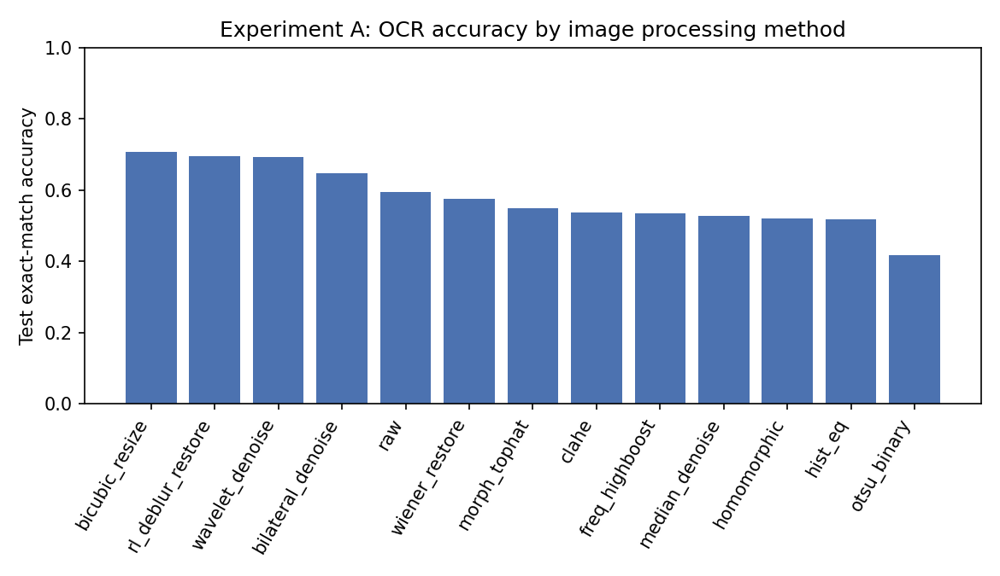
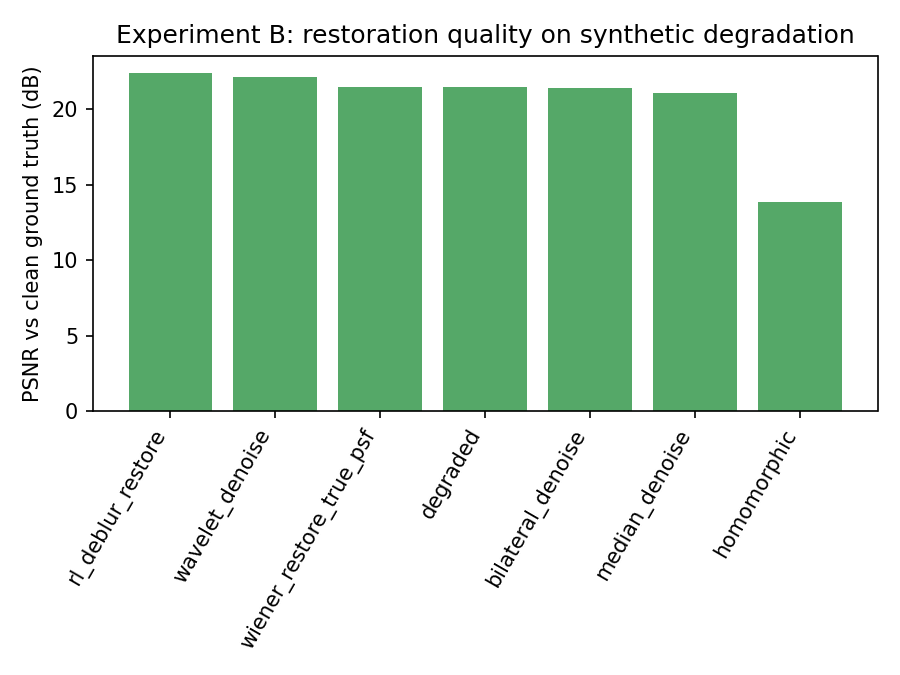

# PARSeq Official ANPR Pipeline

Phần reinforcement learning đã được tách sang project độc lập `D:\NEO\rl_pipeline`. Repository này chỉ còn giữ image-processing/PARSeq nền và các NTFS junction tương thích để absolute path trong audit RL lịch sử không bị hỏng.

Pipeline nhận diện ký tự biển số xe Việt Nam bằng PARSeq chính thức, gồm fine-tune, đánh giá iterative refinement, thử nghiệm tiền xử lý ảnh, benchmark các mô hình enhancement dùng weight chính chủ và demo web inference.

Mục tiêu của repo là kiểm tra các cách cải thiện `exact match` và `character accuracy` trước khi đưa ảnh vào PARSeq, đồng thời giữ quy trình đánh giá tách bạch giữa validation và test.

## 1. Tổng quan

Luồng xử lý chính:

```text
Ảnh đầu vào
  └─ nếu là ảnh toàn cảnh: YOLO detector tìm vùng biển số
      └─ crop biển số
          └─ tiền xử lý ảnh tùy chọn
              └─ resize RGB 32 x 128
                  └─ PARSeq OCR
                      └─ biển số dự đoán + confidence
```

Các phần chính trong repo:

```text
parseq_official_pipeline/
├── parseq/                         # Mã nguồn PARSeq chính thức được vendor vào repo
├── train_no_refinement/            # Script fine-tune PARSeq bằng CLI
├── refinement_finetune/            # Notebook fine-tune và quét refinement
├── preprocessing_best_config/      # Các cấu hình tiền xử lý ảnh và benchmark
├── image_processing_study/         # Ablation study 13 phương pháp xử lý ảnh, train CRNN riêng từng phương pháp
├── demo/                           # Web demo inference + compare preprocessing methods
├── outputs/                        # Checkpoint, log, kết quả benchmark
├── requirements.txt
└── README.md
```

## 2. Dữ liệu

Dữ liệu dùng trong thí nghiệm là dữ liệu private, không được đưa kèm repo. Nếu cần trao đổi hoặc xin quyền truy cập dữ liệu, vui lòng liên hệ:

```text
lenguyenquocanh.work@gmail.com
```

Số lượng dữ liệu đã dùng trong lần fine-tune chính:

| Split | Số ảnh |
| --- | ---: |
| Train | 5.844 |
| Validation | 948 |
| Test | 963 |
| Tổng | 7.755 |

Phân bố theo loại biển:

| Split | xe cơ quan | Ngoại giao | Normal | Other | Quân đội | Dịch vụ |
| --- | ---: | ---: | ---: | ---: | ---: | ---: |
| Train | 1 | 49 | 2.574 | 2.840 | 279 | 101 |
| Validation | 1 | 3 | 551 | 355 | 26 | 12 |
| Test | 1 | 5 | 552 | 355 | 38 | 12 |

Các nguồn dữ liệu đã được cấu hình trong notebook:

| Tên nguồn | Loại | Ghi chú |
| --- | --- | --- |
| `vietnam_normal` | `normal` | Biển số thường, đã chuẩn hóa nhãn |
| `icpr_color_filtered` | `xe cơ quan`, `Dịch vụ`, `other` | Dữ liệu lọc theo màu/loại biển |
| `quandoi` | `quandoi` | Biển quân đội |
| `ngoaigiao` | `ngoaigiao` | Biển ngoại giao |

Với script CLI, dữ liệu cần có dạng:

```text
data_root/
├── images/
│   ├── plate_0001.jpg
│   └── plate_0002.jpg
├── train.csv
├── val.csv
└── test.csv
```

Mỗi file CSV cần hai cột:

```csv
image_path,label
images/plate_0001.jpg,51A4032
images/plate_0002.jpg,80A00538
```

Quy tắc nhãn:

- Chỉ dùng ký tự `0-9` và `A-Z`.
- Nhãn được chuyển sang chữ hoa.
- Nhãn rỗng hoặc dài hơn 12 ký tự sẽ bị loại.
- Test set phải được khóa trước, không dùng để chọn tham số.

## 3. Cài đặt môi trường

Khuyến nghị dùng Python 3.10 trở lên và GPU NVIDIA. Có thể chạy CPU, nhưng fine-tune và benchmark ML sẽ chậm hơn đáng kể.

Tạo môi trường ảo trên Windows:

```powershell
python -m venv .venv
Set-ExecutionPolicy -Scope Process -ExecutionPolicy Bypass
.\.venv\Scripts\Activate.ps1
python -m pip install --upgrade pip
pip install -r requirements.txt
```

Cài thêm kernel để chạy notebook:

```powershell
pip install jupyterlab ipykernel
python -m ipykernel install --user --name parseq-anpr --display-name "PARSeq ANPR"
```

Kiểm tra PyTorch và CUDA:

```powershell
python -c "import torch; print(torch.__version__); print('CUDA:', torch.cuda.is_available()); print(torch.cuda.get_device_name(0) if torch.cuda.is_available() else 'CPU')"
```

Nếu `CUDA: False` trên máy có GPU NVIDIA, cần cài lại PyTorch đúng phiên bản CUDA trước khi train.

## 4. Fine-tune bằng notebook chính

Notebook gốc:

```text
refinement_finetune/PARSeq_Official_ANPR_Refinement_Finetune.ipynb
```

Chạy:

```powershell
jupyter lab refinement_finetune\PARSeq_Official_ANPR_Refinement_Finetune.ipynb
```

Trong notebook, kiểm tra các biến cấu hình quan trọng:

| Biến | Ý nghĩa |
| --- | --- |
| `DATASET_DIR` | Thư mục dữ liệu chính |
| `dataset_sources` | Danh sách nguồn dữ liệu và loại biển |
| `epochs` | Số epoch fine-tune |
| `batch_size` | Batch size |
| `preprocess` | Bật/tắt tiền xử lý trong train |
| `refine_iters` | Số vòng iterative refinement |

Notebook thực hiện:

1. Tải kiến trúc và weight PARSeq chính thức.
2. Chuẩn hóa dữ liệu nhiều loại biển.
3. Đánh giá PARSeq trước fine-tune.
4. Fine-tune bằng PLM loss.
5. Chọn checkpoint tốt nhất theo validation exact match.
6. Quét `refine_iters = 0, 1, 2, 3`.
7. Đánh giá cuối trên test set.
8. Xuất prediction, metric theo loại biển và ảnh nhận diện sai.

Kết quả chính hiện có nằm tại:

```text
outputs/refinement_finetune/
```

Các file quan trọng:

| File | Ý nghĩa |
| --- | --- |
| `best_official_parseq_anpr.pt` | Checkpoint tốt nhất |
| `summary.json` | Cấu hình và metric tổng hợp |
| `history.csv` | Lịch sử train theo epoch |
| `refinement_sweep_val.csv` | Kết quả refinement trên validation |
| `refinement_sweep_test.csv` | Kết quả refinement trên test |
| `eval_val_predictions_best_refine.csv` | Prediction validation |
| `eval_test_predictions_best_refine.csv` | Prediction test |
| `eval_*_by_plate_type.csv` | Metric theo loại biển |

## 5. Fine-tune bằng CLI

Script CLI:

```text
train_no_refinement/parseq_official_anpr_pipeline.py
```

Fine-tune cơ bản:

```powershell
$DATA_ROOT = "D:\path\to\data_root"

python train_no_refinement\parseq_official_anpr_pipeline.py `
  --data-root $DATA_ROOT `
  --output-dir outputs\train_no_refinement `
  --epochs 30 `
  --batch-size 16 `
  --lr 1e-5 `
  --refine-iters 0 `
  --device cuda
```

Fine-tune với ảnh đã tiền xử lý:

```powershell
python train_no_refinement\parseq_official_anpr_pipeline.py `
  --data-root $DATA_ROOT `
  --output-dir outputs\train_clahe_clip1_tile4 `
  --epochs 30 `
  --batch-size 16 `
  --lr 1e-5 `
  --preprocess `
  --preprocess-config clahe_clip1_tile4 `
  --refine-iters 0 `
  --device cuda
```

Có thể thay `--preprocess-config` bằng các cấu hình đã cải thiện như:

```text
adaptive_noise_3way
clahe_rl_deblur_bilateral
clahe_clip1_tile4
raw_rgb
homomorphic_filter
rl_deblur_bilateral_lowpass
```

Xem toàn bộ tham số:

```powershell
python train_no_refinement\parseq_official_anpr_pipeline.py --help
```

Output của CLI:

| File | Ý nghĩa |
| --- | --- |
| `best_official_parseq_anpr.pt` | Checkpoint tốt nhất theo validation |
| `history.csv` | Loss và metric theo epoch |
| `test_predictions.csv` | Prediction từng ảnh test |
| `summary.json` | Cấu hình và metric cuối |

## 6. Kết quả fine-tune hiện tại

Checkpoint tốt nhất:

```text
outputs/refinement_finetune/best_official_parseq_anpr.pt
```

Cấu hình chính:

| Thành phần | Giá trị |
| --- | --- |
| Model | PARSeq official |
| Pretrained | Có |
| Charset | `0123456789ABCDEFGHIJKLMNOPQRSTUVWXYZ` |
| Image size | `32 x 128` |
| Max label length | 12 |
| Epochs | 30 |
| Best epoch | 29 |
| Batch size | 16 |
| Learning rate | `1e-5` |
| Weight decay | `1e-4` |
| Augmentation | Có |
| AMP | Có |
| Seed | 42 |

Kết quả refinement sau fine-tune:

| Split | Refine iters | Samples | Exact match | Character accuracy | CER |
| --- | ---: | ---: | ---: | ---: | ---: |
| Validation | 0 | 948 | 95,89% | 99,40% | 0,60% |
| Validation | 1 | 948 | 95,99% | 99,45% | 0,55% |
| Validation | 2 | 948 | 95,99% | 99,43% | 0,57% |
| Validation | 3 | 948 | 95,99% | 99,40% | 0,60% |
| Test | 0 | 963 | 94,29% | 99,13% | 0,87% |
| Test | 1 | 963 | 94,39% | 99,16% | 0,84% |
| Test | 2 | 963 | 94,50% | 99,17% | 0,83% |
| Test | 3 | 963 | 94,50% | 99,17% | 0,83% |

Theo validation, `refine_iters=1` có CER tốt nhất. Trên test, `refine_iters=2` và `3` cho exact match cao nhất. Khi benchmark preprocessing, repo đang dùng `refine_iters=2`.

Kết quả test theo loại biển:

| Loại biển | Samples | Exact match | Character accuracy |
| --- | ---: | ---: | ---: |
| xe cơ quan | 1 | 100,00% | 100,00% |
| Ngoại giao | 5 | 100,00% | 100,00% |
| Normal | 552 | 93,48% | 98,98% |
| Other | 355 | 97,18% | 99,60% |
| Quân đội | 38 | 86,84% | 97,78% |
| Dịch vụ | 12 | 75,00% | 96,88% |

Lưu ý: số mẫu `xe cơ quan` và `ngoaigiao` trong test còn nhỏ, nên không nên suy luận quá mạnh từ tỷ lệ 100%.

## 7. Benchmark tiền xử lý ảnh

Mã tiền xử lý nằm trong:

```text
preprocessing_best_config/preprocessing.py
```

Script benchmark:

```text
preprocessing_best_config/find_best_preprocessing_config.py
```

Chạy benchmark:

```powershell
python preprocessing_best_config\find_best_preprocessing_config.py `
  --run-dir outputs\refinement_finetune `
  --output-dir outputs\testing\preprocessing_course_benchmark `
  --refine-iters 2 `
  --top-k 3 `
  --batch-size 64 `
  --device cuda
```

Benchmark preprocessing hiện tại dùng test manifest 411 ảnh trong các thư mục `outputs/testing/preprocessing_*_benchmark/`. Đây là tập dùng để so sánh phương pháp tiền xử lý, khác với test 963 ảnh của lần fine-tune chính.

Các nhóm đã thử:

| Nhóm | Ví dụ |
| --- | --- |
| Tăng tương phản cơ bản | `autocontrast`, `percentile_stretch_2_98`, `gamma_1_1` |
| CLAHE | `clahe_clip1_tile4`, `clahe_clip05_tile4`, `clahe_clip1_tile2` |
| Lọc nhiễu | bilateral, Gaussian, median, NLM, wavelet denoise |
| Khôi phục ảnh | Richardson-Lucy deblur, Wiener deconvolution |
| Tần số và chiếu sáng | `homomorphic_filter`, Retinex |
| Tách biên/tăng nét | unsharp, Laplacian, Sobel fusion, top-hat/black-hat |
| Tách vùng ký tự | connected components, content crop, component mask/fusion |
| Tiền xử lý thích ứng | `adaptive_noise_3way`, `adaptive_brightness_3way`, `adaptive_quality_cv` |
| Mô hình ML chính chủ | Real-ESRGAN, Restormer, Zero-DCE |

Kết quả test của các phương pháp tốt nhất:

| Phương pháp | Samples | Exact match | Character accuracy | Ghi chú |
| --- | ---: | ---: | ---: | --- |
| `adaptive_noise_3way` | 411 | 93,43% | 98,99% | Router theo nhiễu, exact tốt nhất |
| `clahe_rl_deblur_bilateral` | 411 | 93,43% | 98,93% | CLAHE nhẹ + Richardson-Lucy + bilateral |
| `clahe_clip1_tile4` | 411 | 93,19% | 99,08% | Char accuracy tốt nhất, đơn giản, nhanh |
| `raw_rgb` | 411 | 93,19% | 98,99% | Đối chứng không tiền xử lý |
| `zero_dce` | 411 | 92,94% | 98,96% | ML enhancement, không hơn raw RGB |
| `restormer_motion_deblur_native` | 411 | 92,94% | 98,96% | ML deblur, chậm hơn nhiều |
| `train_baseline` | 411 | 91,97% | 98,87% | Baseline tiền xử lý lúc train |

Kết luận thực nghiệm:

- `adaptive_noise_3way` và `clahe_rl_deblur_bilateral` cho exact match cao nhất trên test 411 ảnh.
- `clahe_clip1_tile4` có character accuracy cao nhất và là lựa chọn gọn, dễ triển khai.
- `raw_rgb` rất mạnh, cần giữ làm mốc đối chứng.
- Các mô hình ML enhancement tổng quát chưa vượt được CLAHE hoặc raw RGB.
- Tách ký tự bằng connected components không phù hợp với checkpoint PARSeq hiện tại vì PARSeq nhận diện toàn chuỗi, không phải classifier từng ký tự.
- Test 411 ảnh đã được dùng để xác nhận nhiều vòng thí nghiệm, nên cần holdout mới trước khi chốt cấu hình production.

Các report liên quan:

| File | Nội dung |
| --- | --- |
| `preprocessing_best_config/EXPERIMENT_REPORT.md` | Benchmark tiền xử lý truyền thống |
| `preprocessing_best_config/COMBINATION_EXPERIMENT_REPORT.md` | Tổ hợp deblur, low-pass, edge, component |
| `preprocessing_best_config/ADAPTIVE_PREPROCESSING_REPORT.md` | Router thích ứng theo đặc trưng ảnh |
| `preprocessing_best_config/ML_OFFICIAL_BENCHMARK_REPORT.md` | Benchmark Real-ESRGAN, Restormer, Zero-DCE |
| `outputs/testing/tong_hop_phuong_phap_cai_thien_parseq.csv` | Bảng tổng hợp các phương pháp đã cải thiện |

## 8. Benchmark mô hình ML chính chủ

Script:

```text
preprocessing_best_config/ml_official_preprocessing_benchmark.py
```

Các mô hình đã dùng:

| Model | Nhiệm vụ | Nguồn |
| --- | --- | --- |
| Real-ESRGAN x2plus | Super-resolution | Repository chính thức `xinntao/Real-ESRGAN` |
| Restormer motion deblur | Deblur | Repository chính thức `swz30/Restormer` |
| Zero-DCE Epoch99 | Low-light enhancement | Repository chính thức `Li-Chongyi/Zero-DCE` |

Chạy benchmark:

```powershell
python preprocessing_best_config\ml_official_preprocessing_benchmark.py `
  --run-dir outputs\refinement_finetune `
  --output-dir outputs\testing\ml_official_preprocessing_benchmark `
  --refine-iters 2 `
  --top-k-ml 2 `
  --batch-size 64 `
  --ml-batch-size 8 `
  --device cuda
```

Script kiểm tra SHA-256 trước khi load model. Không dùng weight từ mirror không chính thức.

Kết quả xác nhận trên test 411 ảnh:

| Phương pháp | Exact match | Character accuracy |
| --- | ---: | ---: |
| `clahe_clip1_tile4` | 93,19% | 99,08% |
| `raw_rgb` | 93,19% | 98,99% |
| `zero_dce` | 92,94% | 98,96% |
| `restormer_motion_deblur_native` | 92,94% | 98,96% |
| `train_baseline` | 91,97% | 98,87% |

Kết luận: không nên đưa Real-ESRGAN, Restormer hoặc Zero-DCE vào toàn bộ luồng inference mặc định cho checkpoint hiện tại.

## 9. Notebook trực quan hóa tiền xử lý

Notebook:

```text
preprocessing_best_config/plot_improved_preprocessing_methods.ipynb
```

Notebook này plot ảnh trước và sau xử lý của từng phương pháp đã cải thiện accuracy, kèm mô tả lý do phương pháp có thể giúp PARSeq nhận diện tốt hơn.

Nếu gặp lỗi `Unknown preprocessing config`, kiểm tra tên config trong:

```text
preprocessing_best_config/preprocessing.py
```

Một số phương pháp ML như `zero_dce` không phải config thuần trong `preprocessing.py`; chúng được chạy qua benchmark ML riêng.

## 10. Chạy demo web

Demo nằm trong:

```text
demo/
```

Image Docker CPU đã được cấu hình để chạy cùng OCR checkpoint và plate detector
trên mọi Docker host:

```powershell
docker compose up --build
```

Mở `http://localhost:7860`. Xem hướng dẫn deploy và cấu hình cloud tại
[`demo/README.md`](demo/README.md).

Chức năng chính:

- Upload ảnh toàn cảnh hoặc ảnh crop biển số.
- Tự detect vùng biển số bằng YOLO nếu bật `Auto locate`.
- Chọn một phương pháp tiền xử lý để OCR.
- Compare tất cả phương pháp đã cải thiện, sắp xếp theo độ chính xác benchmark.
- Hiển thị ảnh gốc, crop, ảnh sau tiền xử lý, prediction, confidence và mô tả phương pháp.

Cài dependency demo:

```powershell
pip install -r requirements.txt
pip install -r demo\requirements.txt
```

Chạy server:

```powershell
python -m uvicorn demo.app:app --host 127.0.0.1 --port 8000
```

Mở trình duyệt:

```text
http://127.0.0.1:8000
```

Checkpoint mặc định:

```text
outputs/refinement_finetune/best_official_parseq_anpr.pt
```

Detector mặc định được tự dò nếu tồn tại:

```text
..\runs\yolo26_anpr\plate_detect_archive_yolo26m\weights\best.pt
```

Có thể cấu hình bằng biến môi trường:

```powershell
$env:PARSEQ_CHECKPOINT = "D:\path\to\best_official_parseq_anpr.pt"
$env:PARSEQ_DEVICE = "cuda"
$env:PARSEQ_REFINE_ITERS = "2"
$env:PLATE_DETECTOR_CHECKPOINT = "D:\path\to\plate_detector.pt"
$env:PLATE_DETECTOR_CONFIDENCE = "0.25"

python -m uvicorn demo.app:app --host 127.0.0.1 --port 8000
```

Ghi chú:

- Nếu upload ảnh đã crop sát biển số, có thể tắt `Auto locate`.
- Nếu upload ảnh toàn cảnh, nên bật `Auto locate` để YOLO crop biển trước khi OCR.
- Nếu không có detector, demo fallback sang OCR trực tiếp trên ảnh upload, độ chính xác sẽ giảm với ảnh toàn cảnh.

## 11. Các file output nên xem

| Đường dẫn | Nội dung |
| --- | --- |
| `outputs/refinement_finetune/summary.json` | Tổng hợp fine-tune chính |
| `outputs/refinement_finetune/history.csv` | Lịch sử train |
| `outputs/refinement_finetune/refinement_sweep_test.csv` | Test theo refinement |
| `outputs/testing/preprocessing_course_benchmark/validation_results.csv` | Sweep tiền xử lý truyền thống |
| `outputs/testing/preprocessing_combinations_benchmark/test_finalists_results.csv` | Kết quả tổ hợp nhiều bước |
| `outputs/testing/preprocessing_adaptive_benchmark/test_finalists_results.csv` | Kết quả router thích ứng |
| `outputs/testing/ml_official_preprocessing_benchmark/test_finalists_results.csv` | Kết quả ML enhancement |
| `outputs/testing/tong_hop_phuong_phap_cai_thien_parseq.csv` | Tổng hợp phương pháp cải thiện |

## 12. Quy tắc đánh giá

- Chọn checkpoint, `refine_iters` và preprocessing bằng validation.
- Chỉ dùng test để xác nhận cấu hình đã khóa.
- Luôn báo cáo `exact match`, `character accuracy` và `CER`.
- So sánh các phương pháp trên cùng checkpoint, cùng split, cùng manifest.
- Không chọn lại ngưỡng hoặc cấu hình dựa trên test set đã dùng nhiều lần.

Định nghĩa metric:

| Metric | Ý nghĩa |
| --- | --- |
| Exact match | Dự đoán đúng toàn bộ chuỗi biển số |
| Character accuracy | `1 - tổng edit distance / tổng số ký tự` |
| CER | `tổng edit distance / tổng số ký tự` |

## 13. Lỗi thường gặp

Không import được `strhub` hoặc `preprocessing`:

- Chạy lệnh từ thư mục root `parseq_official_pipeline/`.
- Không chạy trực tiếp file từ một working directory khác nếu chưa cấu hình `PYTHONPATH`.
- Các script chính đã tự thêm `parseq/` và `preprocessing_best_config/` vào `sys.path`.

Không tìm thấy checkpoint:

- Kiểm tra `outputs/refinement_finetune/best_official_parseq_anpr.pt`.
- Với demo, đặt lại `$env:PARSEQ_CHECKPOINT`.
- Với benchmark, truyền `--run-dir`, hoặc truyền trực tiếp `--checkpoint`, `--val-manifest`, `--test-manifest`.

CUDA hết bộ nhớ:

- Giảm `--batch-size`.
- Với benchmark ML, giảm thêm `--ml-batch-size`.
- Có thể chuyển sang `--device cpu` để kiểm tra logic, nhưng tốc độ sẽ chậm.

Ảnh toàn cảnh OCR sai:

- PARSeq là model nhận diện chuỗi trên crop biển số, không phải detector.
- Cần bật detector trong demo hoặc crop biển trước khi đưa vào OCR.

Kết quả chạy lại hơi khác:

- Giữ nguyên `--seed`, split dữ liệu, checkpoint, preprocessing và `refine_iters`.
- Một số CUDA kernel vẫn có thể tạo sai khác số học nhỏ.

## 14. Nghiên cứu so sánh các phương pháp xử lý ảnh (`image_processing_study/`)

Đồ án môn **Xử lý ảnh**: ablation study bám khung chương trình môn học, so sánh nhiều kỹ thuật xử
lý ảnh cho bài toán đọc biển số. Khác với mục 7-8 ở trên (chỉ đổi cách tiền xử lý ảnh lúc đánh giá
PARSeq **đã pretrain**), module này **train riêng một model nhỏ từ đầu cho mỗi phương pháp xử lý
ảnh**, để đo đúng câu hỏi "phương pháp nào giúp model học tốt hơn" thay vì chỉ đo độ bền của một
model có sẵn -- PARSeq pretrain quá mạnh nên khác biệt giữa các cách xử lý ảnh gần như bị san phẳng
khi fine-tune. Model dùng ở đây là **CRNN + CTC** nhẹ (~2,19 triệu tham số, kiến trúc kinh điển của
Shi et al.), train from scratch trên đúng 1 bộ train/val/test split cố định
(`dataset.build_split`, `ocr_train.SPLIT_SEED = 42`) từ `color_filtered/{xe cơ quan,other,Dịch vụ}/`, đủ
nhạy để chất lượng ảnh đầu vào thật sự ảnh hưởng tới độ chính xác.

### 14.1 Cấu trúc code

```text
image_processing_study/
├── common.py                        # ANPR_CHARSET, normalize_plate_text, edit_distance
├── dataset.py                       # build_split (split train/val/test cố định), PlateOCRDataset
├── methods.py                       # registry 13 phương pháp xử lý ảnh + Wiener/PSF helper
├── degrade.py                       # sinh suy giảm tổng hợp có kiểm soát (blur/noise) cho Thí nghiệm B
├── model.py                         # CRNN (~2.19M tham số) + CTC greedy decode
├── ocr_train.py                     # vòng lặp train/eval, OCRTrainConfig, fit(), checkpoint I/O
├── run_experiment_a.py              # CLI: train 1 CRNN/phương pháp, xếp hạng theo test accuracy
├── run_experiment_b.py              # CLI: đo PSNR/SSIM + OCR accuracy trên ảnh suy giảm tổng hợp
├── visualize.py                     # sinh lưới ảnh before/after + biểu đồ cột so sánh
├── IMAGE_PROCESSING_STUDY_Colab.ipynb  # notebook chạy trên Colab (GPU T4)
└── README.md                        # tài liệu chi tiết riêng của module này
```

### 14.2 Hai thí nghiệm

- **Thí nghiệm A** (`run_experiment_a.py`) -- train 1 CRNN riêng cho mỗi phương pháp trong
  `methods.py` (cùng kiến trúc/seed/hyperparameter, cùng 1 split), so sánh exact-match accuracy /
  CER trên tập test. Đây là bảng kết quả chính, trả lời "phương pháp xử lý ảnh nào tốt nhất cho
  OCR biển số".
- **Thí nghiệm B** (`run_experiment_b.py`) -- vì ảnh biển số thật không có "ảnh sạch" đã biết để so
  sánh, thí nghiệm này tạo suy giảm tổng hợp có kiểm soát (`degrade.py`: Gaussian/motion/defocus
  blur, Gaussian noise) trên đúng tập test của Thí nghiệm A, rồi đo PSNR/SSIM và OCR accuracy (qua
  model `raw` đã train ở Thí nghiệm A) của các phương pháp phục hồi ảnh -- gồm cả agent RL deblur
  (`rl_deblur/`) để so sánh với các phương pháp cổ điển.

### 14.3 13 phương pháp xử lý ảnh (`methods.py`)

| Method | Kỹ thuật | Chương môn học |
| --- | --- | --- |
| `raw` | Không xử lý (đối chứng), resize bilinear | baseline |
| `bicubic_resize` | Resize bicubic thay vì bilinear | 7.1 Sampling & Interpolation |
| `hist_eq` | Global histogram equalization | 1.1 Gray-level processing |
| `otsu_binary` | Otsu threshold → nhị phân | 1.2 Binary image processing |
| `clahe` | Adaptive histogram equalization | 2.1 Linear filtering / enhancement |
| `median_denoise` | Median filter | 2.2 Nonlinear filtering |
| `bilateral_denoise` | Bilateral filter | 2.2 Nonlinear filtering |
| `morph_tophat` | White + black top-hat | 2.3 Morphological filtering |
| `freq_highboost` | High-boost filter qua FFT | 2.5 Frequency-domain filtering |
| `homomorphic` | Homomorphic filtering | 2.5 / 3.1 Restoration model |
| `wavelet_denoise` | Wavelet soft-threshold (BayesShrink) | 3.5 Wavelet denoising |
| `wiener_restore` | Wiener deconvolution (PSF giả định) | 3.1/3.4/3.6 Restoration & MMSE |
| `rl_deblur_restore` | Agent RL (PixelRL + A2C) từ `rl_deblur/` | so sánh deep-learning restoration |

`rl_deblur_restore` chỉ được thêm vào nếu tìm thấy checkpoint đã train
(`outputs/rl_deblur/checkpoints/best_deblur_agent.pt`); nếu không có, method này tự bỏ qua (có log
cảnh báo) thay vì làm hỏng cả sweep.

### 14.4 Chạy

Smoke test local (CPU, để bắt lỗi cú pháp/shape/CTC trước khi chạy thật):

```bash
python -m image_processing_study.run_experiment_a \
  --methods raw clahe wavelet_denoise --no-include-rl \
  --epochs 2 --batch-size 16 --limit-train 60 --limit-val 20 --limit-test 20 --device cpu

python -m image_processing_study.run_experiment_b \
  --raw-checkpoint outputs/image_processing_study/experiment_a/raw/best_model.pt \
  --no-include-rl --limit 20 --device cpu
```

Chạy thật trên Colab: notebook `IMAGE_PROCESSING_STUDY_Colab.ipynb` chỉ giải nén 1 file zip rồi
`import image_processing_study` trực tiếp (không dùng `%%writefile`), nên zip cần gộp cả code lẫn
data:

```bash
zip -r parseq_ip_study_data.zip \
  image_processing_study color_filtered rl_deblur \
  outputs/rl_deblur/checkpoints/best_deblur_agent.pt \
  -x "*/__pycache__/*" "*.ipynb"
```

Upload lên Google Drive rồi mở notebook trên Colab (Runtime > GPU T4). Notebook chạy cả 2 thí
nghiệm, sinh ảnh minh họa + biểu đồ so sánh, và nén `outputs/image_processing_study/` gửi lại
Drive. Chi tiết đầy đủ hơn (bao gồm cấu hình huấn luyện, biến kiểm soát, cách đọc log) nằm ở
[`image_processing_study/README.md`](image_processing_study/README.md).

### 14.5 Kết quả Thí nghiệm A -- xếp hạng theo test exact-match (367 mẫu test)

Cấu hình: 100 epoch tối đa, early stopping patience 10, batch size 64, lr `1e-3`, seed 42, cùng
split cho mọi phương pháp (`outputs/image_processing_study/experiment_a/run_config.json`).

| Hạng | Method | Chương | Test exact match | Test CER | Test char acc | Best epoch |
| ---: | --- | --- | ---: | ---: | ---: | ---: |
| 1 | `bicubic_resize` | 7.1 Sampling & Interpolation | 70,84% | 5,09% | 94,91% | 53 |
| 2 | `rl_deblur_restore` | Deep-learning restoration (so sánh) | 69,48% | 5,42% | 94,58% | 52 |
| 3 | `wavelet_denoise` | 3.5 Wavelet denoising | 69,21% | 6,07% | 93,93% | 68 |
| 4 | `bilateral_denoise` | 2.2 Nonlinear filtering | 64,85% | 6,26% | 93,74% | 86 |
| 5 | `raw` (baseline) | -- | 59,40% | 8,37% | 91,63% | 42 |
| 6 | `wiener_restore` | 3.1/3.4/3.6 Restoration & MMSE | 57,49% | 9,09% | 90,91% | 38 |
| 7 | `morph_tophat` | 2.3 Morphological filtering | 55,04% | 9,38% | 90,62% | 49 |
| 8 | `clahe` | 2.1 Linear filtering / enhancement | 53,68% | 9,28% | 90,72% | 54 |
| 9 | `freq_highboost` | 2.5 Frequency-domain filtering | 53,41% | 9,21% | 90,79% | 42 |
| 10 | `median_denoise` | 2.2 Nonlinear filtering | 52,86% | 9,28% | 90,72% | 36 |
| 11 | `homomorphic` | 2.5 / 3.1 Restoration model | 52,04% | 9,93% | 90,07% | 58 |
| 12 | `hist_eq` | 1.1 Gray-level processing | 51,77% | 9,96% | 90,04% | 43 |
| 13 | `otsu_binary` | 1.2 Binary image processing | 41,69% | 20,90% | 79,10% | 46 |

Kết luận nhanh: `bicubic_resize`, `rl_deblur_restore` và `wavelet_denoise` là 3 phương pháp duy
nhất vượt qua baseline `raw` một cách rõ rệt; `otsu_binary` (nhị phân hoá cứng) làm mất quá nhiều
thông tin và tệ nhất trong 13 phương pháp.

### 14.6 Kết quả Thí nghiệm B -- phục hồi ảnh suy giảm tổng hợp (367 mẫu, dùng model `raw`)

Phân bố loại suy giảm tổng hợp: `gaussian_blur` 97, `gaussian_noise` 94, `defocus_blur` 93,
`motion_blur` 83 mẫu (`outputs/image_processing_study/experiment_b/degradation_kind_counts.csv`).

| Method | Chương | PSNR (dB) | SSIM | OCR exact match | OCR CER |
| --- | --- | ---: | ---: | ---: | ---: |
| `clean` (upper bound) | ground truth | ∞ | 1,000 | 59,40% | 8,42% |
| `rl_deblur_restore` | Deep-learning restoration (so sánh) | 22,42 | 0,831 | 44,41% | 16,08% |
| `wavelet_denoise` | 3.5 Wavelet denoising | 22,13 | 0,777 | 35,42% | 23,28% |
| `wiener_restore_true_psf` | 3.1/3.4/3.6 Restoration & MMSE | 21,51 | 0,789 | 33,79% | 23,49% |
| `degraded` (lower bound) | không phục hồi | 21,49 | 0,759 | 35,42% | 23,35% |
| `bilateral_denoise` | 2.2 Nonlinear filtering | 21,44 | 0,745 | 30,52% | 26,60% |
| `median_denoise` | 2.2 Nonlinear filtering | 21,06 | 0,746 | 32,15% | 26,21% |
| `homomorphic` | 2.5 / 3.1 Restoration model | 13,87 | 0,608 | 20,71% | 30,46% |

Kết luận nhanh: `rl_deblur_restore` phục hồi tốt nhất cả về PSNR/SSIM lẫn OCR accuracy trong số
các phương pháp thử nghiệm, bỏ xa các bộ lọc cổ điển; `homomorphic` làm giảm PSNR xuống dưới cả
`degraded` (không phục hồi) -- filter này không phù hợp với kiểu suy giảm blur/noise tổng hợp ở
đây. `wiener_restore_true_psf` dùng đúng PSF đã tạo suy giảm (khác với `wiener_restore` ở Thí
nghiệm A vốn giả định PSF) nhưng vẫn không cải thiện được OCR accuracy so với không xử lý gì.

### 14.7 Ảnh minh hoạ

| File | Nội dung |
| --- | --- |
| [`experiment_a_accuracy_bar.png`](outputs/image_processing_study/samples/experiment_a_accuracy_bar.png) | Biểu đồ cột xếp hạng exact-match accuracy 13 phương pháp (Thí nghiệm A) |
| [`experiment_a_methods_grid.png`](outputs/image_processing_study/samples/experiment_a_methods_grid.png) | Lưới ảnh cùng 1 biển số qua từng phương pháp xử lý |
| [`experiment_b_psnr_bar.png`](outputs/image_processing_study/samples/experiment_b_psnr_bar.png) | Biểu đồ cột PSNR các phương pháp phục hồi (Thí nghiệm B) |
| [`experiment_b_restoration_grid.png`](outputs/image_processing_study/samples/experiment_b_restoration_grid.png) | Lưới ảnh clean/degraded/từng phương pháp phục hồi, theo 4 kiểu suy giảm |
| [`preview_processed_samples.png`](outputs/image_processing_study/samples/preview_processed_samples.png) | Xem trước ảnh đã xử lý của 13 phương pháp trên 5 mẫu từ split train |





### 14.8 File output

| Đường dẫn | Nội dung |
| --- | --- |
| `outputs/image_processing_study/experiment_a/<method>/{best_model.pt,history.csv,test_predictions.csv,summary.json}` | Checkpoint, lịch sử train, prediction, tổng hợp từng phương pháp |
| `outputs/image_processing_study/experiment_a/comparison.csv` | Bảng xếp hạng chính của Thí nghiệm A |
| `outputs/image_processing_study/experiment_a/run_config.json` | Hyperparameter dùng chung cho cả sweep |
| `outputs/image_processing_study/experiment_b/comparison.csv` | PSNR/SSIM + OCR theo phương pháp phục hồi |
| `outputs/image_processing_study/experiment_b/degradation_kind_counts.csv` | Phân bố loại suy giảm tổng hợp |
| `outputs/image_processing_study/experiment_b/run_summary.json` | Cấu hình chạy (model OCR dùng, danh sách phương pháp phục hồi) |
| `outputs/image_processing_study/samples/` | Lưới ảnh before/after + biểu đồ cột |
