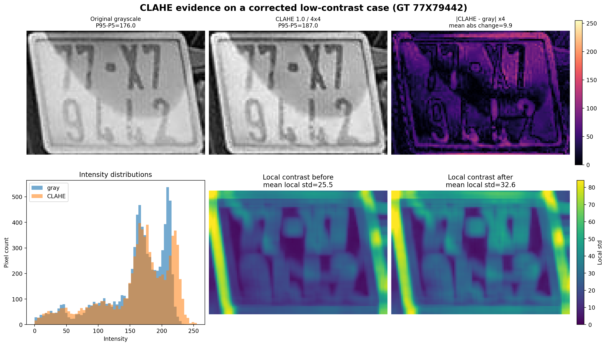
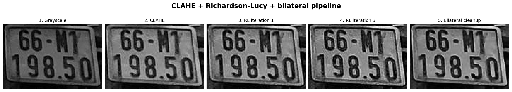
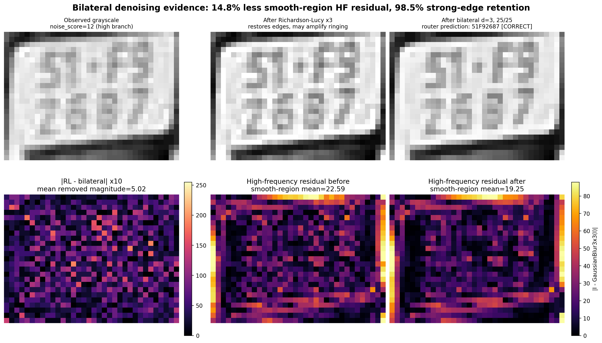
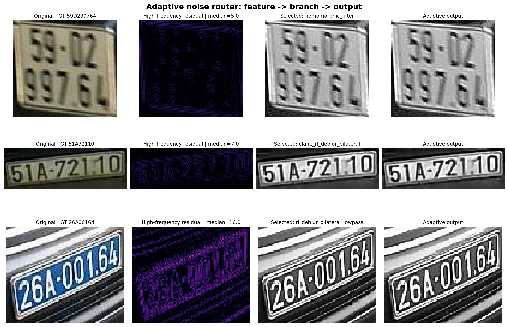
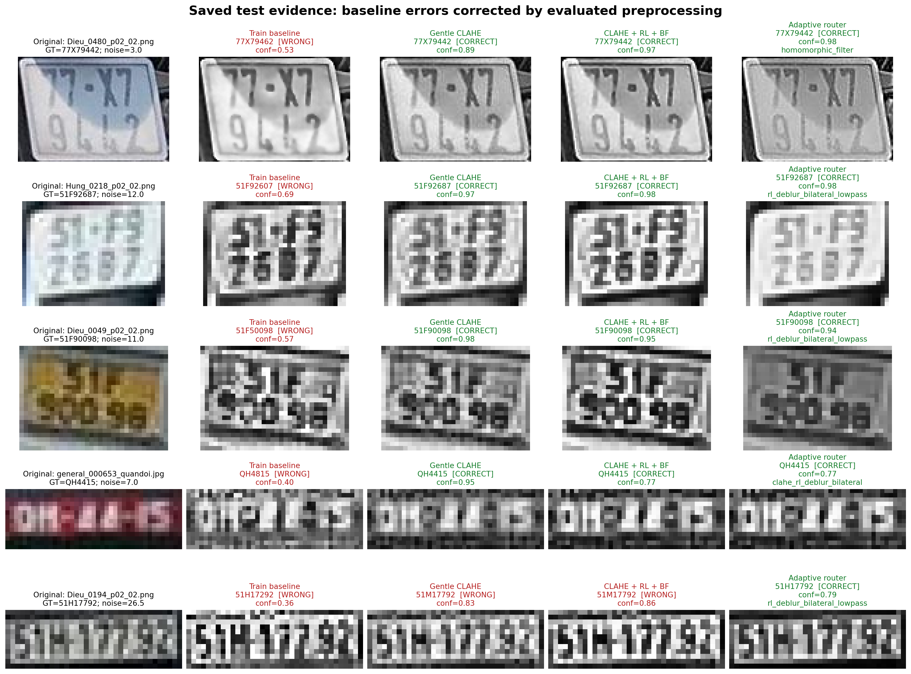
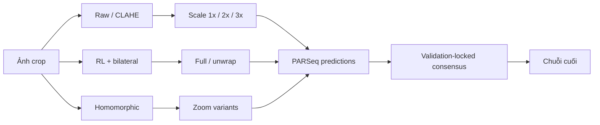
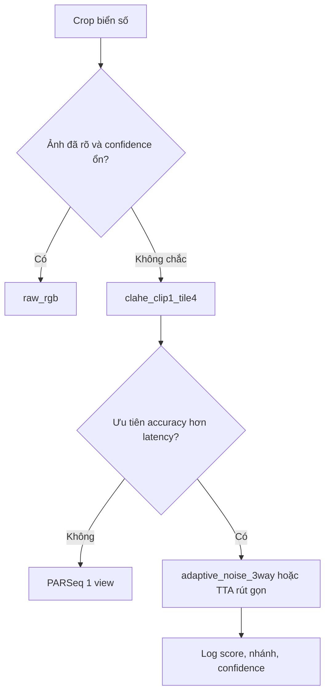

# Luồng thuyết trình: tiền xử lý ảnh hiệu quả cho PARSeq ANPR

Tài liệu này là kịch bản thuyết trình khoảng **20–25 phút** về các phương pháp
tiền xử lý ảnh đã được kiểm chứng với checkpoint PARSeq hiện tại. Checkpoint và
benchmark chỉ dùng các nhóm **`blue`, `other`, `yellow`, `quandoi`, `ngoaigiao`**;
nguồn/loại `normal` không tham gia train, validation hoặc test. Nội dung dùng đúng
tập test **411 ảnh**, đầu vào PARSeq `32 × 128` và `refine_iters=2`.

Thông điệp xuyên suốt:

> Tiền xử lý tốt không phải là làm ảnh đẹp nhất, mà là làm tín hiệu ký tự dễ nhận
> hơn trong khi giữ nguyên hình học và phân phối ảnh mà PARSeq đã học.

---

## Slide 1 — Bài toán cần giải quyết

**Thời lượng:** 1 phút

### Nội dung trên slide

- Ảnh biển số nhỏ, mờ, thiếu sáng, phản sáng và nhiễu không đồng nhất.
- PARSeq nhận một tensor cố định `32 × 128`.
- Resize không thể tự khôi phục chi tiết đã mất.
- Một bộ lọc mạnh áp dụng cho mọi ảnh có thể làm ảnh tốt trở nên xấu hơn.

### Lời thuyết trình

PARSeq là recognizer chuỗi mạnh, nhưng vẫn phụ thuộc vào chất lượng crop đầu vào.
Hai ảnh cùng một biển có thể khác rất lớn về độ sáng, blur và kích thước. Vì thế
câu hỏi nghiên cứu không phải “bộ lọc nào làm ảnh nét nhất”, mà là “biến đổi nào
làm giảm lỗi chuỗi trên toàn bộ tập ảnh mà không phá hình dạng ký tự”.

### Chuyển ý

Muốn trả lời đúng, trước hết phải cố định giao diện đầu vào và thước đo đánh giá.

---

## Slide 2 — Giao diện ảnh đi vào PARSeq

**Thời lượng:** 1 phút

### Nội dung trên slide

```text
Ảnh/crop biển số
    → tiền xử lý tùy chọn
    → bicubic resize 32 × 128
    → ToTensor [0, 1]
    → normalize [-1, 1]
    → PARSeq
    → chuỗi ký tự + confidence
```

Phép chuẩn hóa tensor:

$$
x_{norm}=\frac{x/255-0.5}{0.5}=2\frac{x}{255}-1
$$

### Lời thuyết trình

Mọi phương pháp đều phải trả về ảnh RGB ba kênh. Ngay cả khi tín hiệu hữu ích là
grayscale, ảnh xám vẫn được lặp lại thành ba kênh trước khi đưa vào model. Kích
thước cuối luôn là `32 × 128`; do đó mọi so sánh chỉ thay phần trước resize.

---

## Slide 3 — Cách đánh giá và baseline

**Thời lượng:** 1,5 phút

### Nội dung trên slide

Phạm vi dữ liệu của checkpoint hiện tại:

| Split | Blue | Other | Yellow | Quân đội | Ngoại giao | Tổng |
|---|---:|---:|---:|---:|---:|---:|
| Train | 1 | 2.840 | 101 | 279 | 49 | 3.270 |
| Validation | 1 | 355 | 12 | 26 | 3 | 397 |
| Test | 1 | 355 | 12 | 38 | 5 | 411 |

Không có nguồn hoặc loại biển `normal` trong ba split trên.

Baseline đúng với pipeline lúc fine-tune:

```text
RGB → grayscale → CLAHE 2.0 / grid 8×8
    → bilateral d=5, σcolor=50, σspace=50
    → unsharp α=0.5, σ=1.0
```

Hai metric:

$$
\text{Exact Match}=\frac{\#\{\hat y_i=y_i\}}{N}
$$

$$
\text{Character Accuracy}
=1-\frac{\sum_i ED(\hat y_i,y_i)}{\sum_i |y_i|}
$$

| Mốc | Exact match | Character accuracy |
|---|---:|---:|
| `train_baseline` | 91,97% | 98,87% |

### Lời thuyết trình

Exact match là metric chính vì chỉ một ký tự sai cũng làm biển số sai. Character
accuracy giúp phân biệt lỗi một ký tự với lỗi cả chuỗi. Baseline đã mạnh nhưng
xử lý tương đối nhiều bước; CLAHE mạnh, bilateral và unsharp có thể cùng khuếch
đại halo hoặc làm nét ký tự dày hơn mức model từng học.

---

## Slide 4 — Kết quả quan trọng: “ít xử lý” đôi khi tốt hơn

**Thời lượng:** 1 phút

### Nội dung trên slide

| Phương pháp | Exact | Character | Tốc độ |
|---|---:|---:|---:|
| `raw_rgb` | 93,19% | 98,99% | 307,29 ảnh/s |
| `train_baseline` | 91,97% | 98,87% | — |

### Lời thuyết trình

Chỉ giữ RGB, resize và normalize đã tăng exact match thêm 1,22 điểm phần trăm so
với baseline. Kết quả này đặt ra nguyên tắc đối chứng: mọi phương pháp tăng cường
phải thắng cả baseline lẫn raw RGB. Nếu không, phần “cải thiện thị giác” có thể
chỉ là biến đổi đẹp với mắt người nhưng gây domain shift cho model.

---

## Slide 5 — Phương pháp 1: CLAHE nhẹ

**Thời lượng:** 2 phút

### Nội dung trên slide

```text
RGB → luma grayscale
    → CLAHE clipLimit=1.0, tileGridSize=4×4
    → resize → PARSeq
```



Hình không chỉ đặt hai ảnh xám cạnh nhau. Cột sai khác khuếch đại
`|CLAHE - gray| × 4` chỉ ra chính xác pixel nào bị thay đổi; histogram và hai bản
đồ độ lệch chuẩn cục bộ đo mức tăng tương phản. Trên ca `77X79442`, dải
`P95-P5` tăng từ `176` lên `187`, độ lệch chuẩn cục bộ trung bình tăng từ `25,5`
lên `32,6`, đồng thời dự đoán đã lưu đổi từ `77X79462` (sai) thành `77X79442`
(đúng).

Chuyển grayscale gần đúng:

$$
Y=0.299R+0.587G+0.114B
$$

### CLAHE làm gì?

Với histogram cục bộ $h(k)$, giới hạn mỗi bin bởi ngưỡng $T$:

$$
h_c(k)=\min(h(k),T)
$$

Phần histogram bị cắt được phân phối lại, rồi dùng CDF để ánh xạ mức xám:

$$
g(k)=(L-1)\sum_{j=0}^{k}p_c(j)
$$

Kết quả giữa các tile được nội suy để không tạo đường biên ô.

### Vì sao cấu hình này tốt?

- Tăng tương phản cục bộ giữa nét chữ và nền khi có bóng đổ hoặc phản sáng.
- `clipLimit=1.0` hạn chế khuếch đại noise tốt hơn baseline `2.0`.
- Grid `4 × 4` tạo vùng thống kê lớn hơn `8 × 8`, giảm hạt và halo.
- Không thêm sharpen/denoise nên ít làm đứt, dày hoặc biến dạng nét.

### Kết quả

| Cấu hình | Exact | Character | Sửa đúng / làm sai |
|---|---:|---:|---:|
| `clahe_clip1_tile4` | 93,19% | **99,08%** | 9 / 4 |

Đây là lựa chọn mặc định cân bằng nhất về accuracy, tốc độ và độ đơn giản.

---

## Slide 6 — Phương pháp 2: khử mờ Richardson–Lucy

**Thời lượng:** 2 phút

### Nội dung trên slide

Mô hình suy giảm ảnh:

$$
y=h\otimes x+n
$$

Trong đó $x$ là ảnh nét cần tìm, $h$ là PSF, $y$ là ảnh quan sát và $n$ là
nhiễu. Pipeline dùng Gaussian PSF `3 × 3`, $\sigma=0.7$.

Cập nhật Richardson–Lucy:

$$
x^{(t+1)}=x^{(t)}\left[
h_{flip}\otimes\frac{y}{h\otimes x^{(t)}+\epsilon}
\right]
$$



### Lời thuyết trình

Từ ước lượng ảnh nét hiện tại, ta làm mờ ngược bằng PSF để dự đoán ảnh quan sát.
Tỷ lệ giữa quan sát thật và dự đoán cho biết phần sai lệch. Sai lệch được chiếu
ngược về các pixel nguồn và nhân vào ước lượng hiện tại. Phép cập nhật giữ ảnh
không âm và khôi phục dần thành phần cao tần.

Pipeline chỉ dùng **3 vòng**. Nhiều vòng hơn không đồng nghĩa tốt hơn: RL sẽ bắt
đầu khuếch đại nhiễu, tạo viền sáng/tối và có thể biến `8` thành `B`, `1` thành
`I` hoặc làm hai nét gần nhau dính lại.

---

## Slide 7 — Vì sao phải đặt bilateral sau RL?

**Thời lượng:** 1,5 phút

### Nội dung trên slide

Với pixel trung tâm $p$:

$$
I'(p)=\frac{1}{W_p}\sum_{q\in\Omega}
I(q)
\exp\left(-\frac{\|p-q\|^2}{2\sigma_s^2}\right)
\exp\left(-\frac{|I(p)-I(q)|^2}{2\sigma_r^2}\right)
$$

Tham số thực tế:

```text
d=3, sigmaColor=25, sigmaSpace=25
```



Ở đây dùng ca khó `51F92687` có `noise_score = 12`, đúng nhánh nhiễu cao của
router. Vì bilateral được cấu hình nhẹ, ảnh đầu ra nhìn bằng mắt có thể chỉ thay
đổi ít. Bản đồ `|RL - bilateral| × 10` làm phần bị loại hiện rõ; hai bản đồ cao
tần dùng cùng thang màu để so sánh công bằng. Sau bilateral, cao tần trung bình
trong vùng trơn giảm `14,8%`, trong khi độ lớn gradient ở nhóm biên mạnh còn
`98,5%`. Đây là bằng chứng cho hiệu ứng làm sạch có giữ cạnh, không chỉ là đổi
sang grayscale. Do không có ảnh sạch ground truth ở mức pixel, đại lượng này
được trình bày đúng là **proxy cao tần**: nó chứng minh bilateral đã lọc thành
phần dao động nhỏ trong vùng trơn, không khẳng định mọi thành phần bị lọc đều là
nhiễu cảm biến thuần túy.

### Lời thuyết trình

Gaussian filter chỉ xét khoảng cách không gian nên dễ làm mờ cạnh. Bilateral
xét thêm khoảng cách cường độ: hai pixel ở hai phía một nét chữ có mức sáng rất
khác nhau nên ít bị trộn. Vì vậy nó dọn noise/ringing mà RL sinh ra nhưng vẫn
giữ biên ký tự.

### Ý tưởng kết hợp

```text
CLAHE nhẹ                 RL 3 vòng                 Bilateral nhẹ
tách chữ khỏi nền   →     phục hồi biên mờ    →     dọn ringing, giữ cạnh
```

Thứ tự không nên đảo: denoise trước deblur có thể xóa chi tiết RL cần phục hồi;
sharpen sau cùng có thể tái khuếch đại ringing vừa được dọn.

### Kết quả

| Cấu hình | Exact | Character | Sửa đúng / làm sai |
|---|---:|---:|---:|
| `clahe_rl_deblur_bilateral` | **93,43%** | 98,93% | 9 / 3 |

---

## Slide 8 — Phương pháp 3: router thích ứng theo nhiễu

**Thời lượng:** 2 phút

### Nội dung trên slide

Đặc trưng cao tần:

$$
R=|G-\operatorname{GaussianBlur}_{3\times3}(G)|
$$

$$
noise\_score=\operatorname{median}(R)
$$

Luật đã khóa trên validation:

```text
noise_score ≤ 5       → homomorphic_filter
5 < noise_score ≤ 10  → clahe_rl_deblur_bilateral
noise_score > 10      → rl_deblur_bilateral_lowpass
```



### Lời thuyết trình

Median bền vững hơn mean trước một vài cạnh hoặc điểm sáng mạnh. Tuy nhiên đây
là chỉ số năng lượng cao tần, không phải noise cảm biến thuần túy; texture và
nét chữ cũng đóng góp vào score.

Router giải quyết nhược điểm của pipeline cố định:

- ảnh tương đối sạch/ít cao tần được sửa chiếu sáng bằng homomorphic;
- ảnh mức trung bình nhận CLAHE + RL + bilateral;
- ảnh có nhiều cao tần dùng RL + bilateral và bỏ CLAHE để tránh khuếch đại thêm.

### Kết quả

| Cấu hình | Exact | Character | Sửa đúng / làm sai | Tốc độ |
|---|---:|---:|---:|---:|
| `adaptive_noise_3way` | **93,43%** | 98,99% | 10 / 4 | 159,68 ảnh/s |

---

## Slide 9 — Nhánh homomorphic: sửa chiếu sáng trong miền tần số

**Thời lượng:** 1,5 phút

### Nội dung trên slide

Mô hình ảnh:

$$
I(x,y)=L(x,y)R(x,y)
$$

Lấy log:

$$
\log I=\log L+\log R
$$

Hàm truyền dùng trong code:

$$
H(u,v)=(\gamma_H-\gamma_L)
\left(1-e^{-D(u,v)^2/D_0^2}\right)+\gamma_L
$$

với $\gamma_L=0.7$, $\gamma_H=1.4$ và
$D_0=\max(\min(H,W)/4,2)$.

### Lời thuyết trình

Chiếu sáng thường biến thiên chậm nên nằm ở tần số thấp; nét chữ và phản xạ thay
đổi nhanh hơn nên nằm ở tần số cao. Homomorphic giảm gain thấp tần và tăng nhẹ
cao tần, sau đó biến đổi Fourier ngược, lấy `exp` và rescale percentile `1–99%`.
Nó phù hợp với bóng đổ/chiếu sáng không đều, nhưng có thể quá mạnh trên ảnh vốn
đã sáng và nhiều texture; vì thế nó được đặt trong router thay vì áp dụng toàn
cục.

---

## Slide 10 — Bằng chứng trên các ca khó thật sự được sửa đúng

**Thời lượng:** 1 phút



### Lời thuyết trình

Hình chọn năm mẫu trực tiếp từ CSV dự đoán test đã lưu, không chọn vì “nhìn đẹp”.
Mỗi hàng ghi nhãn thật, `noise_score`, dự đoán, confidence và nhánh router. Bốn
hàng đầu cho thấy nhiều pipeline cùng sửa được lỗi baseline trên biển tương phản
thấp, biển rất nhỏ, biển vàng và biển quân đội. Hàng `Dieu_0194` còn là một đối
chứng quan trọng: các chuỗi cố định vẫn sai, chỉ router chọn nhánh
`rl_deblur_bilateral_lowpass` mới sửa `51H17292` thành `51H17792`. Vì vậy luận
điểm không còn dựa vào khác biệt cảm quan giữa các ảnh xám, mà dựa trên ca lỗi
được sửa và kết quả inference có thể truy ngược.

---

## Slide 11 — Bảng kết quả tổng hợp

**Thời lượng:** 1,5 phút

| Phương pháp | Exact | Character | Δ exact | Δ character | Vai trò |
|---|---:|---:|---:|---:|---|
| `adaptive_noise_3way` | **93,43%** | 98,99% | **+1,46** | +0,12 | Accuracy-first thích ứng |
| `clahe_rl_deblur_bilateral` | **93,43%** | 98,93% | **+1,46** | +0,06 | Chuỗi cố định phục hồi blur |
| `clahe_clip1_tile4` | 93,19% | **99,08%** | +1,22 | **+0,21** | Mặc định gọn và ổn định |
| `raw_rgb` | 93,19% | 98,99% | +1,22 | +0,12 | Fallback/đối chứng |
| `train_baseline` | 91,97% | 98,87% | 0 | 0 | Baseline |

### Cách diễn giải đúng

- Exact cao nhất thuộc router và chuỗi CLAHE–RL–bilateral.
- Character accuracy cao nhất thuộc CLAHE nhẹ.
- Chênh lệch chỉ tương ứng vài ảnh trên 411 mẫu.
- CI bootstrap 95% của delta vẫn chứa 0; chưa đủ bằng chứng để tuyên bố production
  chắc chắn tốt hơn trên camera mới.

---

## Slide 12 — Ý tưởng kết hợp nhiều view: Multi-scale TTA

**Thời lượng:** 1,5 phút

### Nội dung trên slide



| Phương pháp | Exact | Character | Sửa đúng / làm sai |
|---|---:|---:|---:|
| Baseline | 91,97% | 98,87% | — |
| Consensus 65 view | **93,92%** | **99,17%** | 11 / 3 |

### Lời thuyết trình

Các view có lỗi khác nhau. Chuỗi được nhiều view độc lập hỗ trợ thường ổn định
hơn prediction đơn. Upscale trước resize giúp nội suy nét ở crop rất nhỏ; unwrap
hữu ích cho biển hai dòng. Đổi lại, 65 view tốn nhiều lượt OCR nên phù hợp chế
độ accuracy-first, không phải mặc định thời gian thực.

---

## Slide 13 — Vì sao các phương pháp “mạnh” lại thất bại?

**Thời lượng:** 1,5 phút

| Phương pháp | Vấn đề chính |
|---|---|
| Otsu/adaptive threshold | Mất anti-alias, mức xám và độ dày nét |
| Morphological closing | Nối nhầm nét/ký tự gần nhau |
| Median/wavelet denoise | Xóa nét mảnh trong crop nhỏ |
| Letterbox | Thay hình học so với cách model đã học stretch `32 × 128` |
| Wiener/deblur mạnh | PSF sai tạo ringing và noise cao tần |
| Component mask | Tách sai nét dính, nét đứt và mất ngữ cảnh chuỗi |
| Real-ESRGAN/Restormer | Sinh texture hoặc biên lệch miền OCR |

### Lời thuyết trình

Recognizer không nhìn ảnh giống con người. Nó đã học từ một phân phối cụ thể về
độ dày nét, anti-alias và hình học. Biến đổi làm ảnh “sạch” hơn nhưng phá những
dấu hiệu này có thể giảm accuracy. Vì vậy pipeline tốt nhất đều tương đối nhẹ và
có cơ chế giới hạn khuếch đại.

---

## Slide 14 — Khuyến nghị triển khai

**Thời lượng:** 1 phút



### Cấu hình đề xuất

1. **Mặc định:** `clahe_clip1_tile4`.
2. **Fallback nhanh:** `raw_rgb` khi ảnh đã tốt hoặc CLAHE làm giảm confidence.
3. **Ảnh mờ/không đồng nhất:** `adaptive_noise_3way`, nhưng phải log nhánh và
   giám sát drift.
4. **Accuracy-first:** TTA rút gọn sau khi chọn view trên validation độc lập.

---

## Slide 15 — Giới hạn và nguyên tắc thực nghiệm

**Thời lượng:** 1 phút

- Tập test có 411 ảnh; mỗi thay đổi vài ảnh làm metric dao động đáng kể.
- Test đã tham gia xác nhận nhiều vòng thí nghiệm, cần holdout mới trước production.
- Checkpoint và mọi benchmark trong báo cáo chỉ dùng `blue`, `other`, `yellow`,
  `quandoi`, `ngoaigiao`; không dùng `normal`.
- Audit trên pixel RGB cho `4.078/4.078` hash duy nhất và `0` nhóm ảnh trùng
  pixel chéo train, validation, test.
- Split hiện tại được tạo ở mức ảnh. Một benchmark tương lai có thể group theo
  vehicle/track trước khi chia để đo khả năng tổng quát hóa nghiêm ngặt hơn. Đây
  chỉ là đề xuất nâng chuẩn đánh giá; kết quả hiện tại vẫn được báo cáo trên split
  không trùng pixel.
- Ngưỡng router phụ thuộc camera và có thể drift khi ánh sáng/noise thay đổi.

### Quy trình đánh giá tiếp theo

```text
group theo vehicle/track/source image
    → chia train/validation/test
    → chọn phương pháp và ngưỡng trên validation
    → khóa cấu hình
    → đánh giá đúng một lần trên holdout
    → báo CI + số ảnh sửa đúng/làm sai + latency
```

---

## Slide 16 — Kết luận

**Thời lượng:** 45 giây

### Ba ý cần nhớ

1. **CLAHE nhẹ** là lựa chọn cân bằng nhất: đơn giản, nhanh và character accuracy
   cao nhất.
2. **CLAHE + Richardson–Lucy + bilateral** có logic bổ trợ rõ ràng: tăng tương
   phản → khôi phục blur → dọn ringing.
3. **Router thích ứng** đạt exact match cao nhất vì không ép mọi ảnh dùng cùng
   một phép xử lý, nhưng cần kiểm soát drift và holdout mới.

> Kết quả tốt nhất đến từ việc xử lý vừa đủ và đúng nhóm ảnh, không phải từ việc
> xếp càng nhiều bộ lọc càng tốt.

---

## Slide dự phòng A — Công thức và tham số nhanh

| Thành phần | Công thức/ý nghĩa | Tham số dùng |
|---|---|---|
| Luma | $0.299R+0.587G+0.114B$ | — |
| CLAHE | Clip histogram + CDF cục bộ | clip `1.0`, grid `4 × 4` |
| Gaussian PSF | $h\propto e^{-(x^2+y^2)/(2\sigma^2)}$ | `3 × 3`, $\sigma=0.7$ |
| Richardson–Lucy | Multiplicative likelihood update | 3 vòng |
| Bilateral | Spatial Gaussian × range Gaussian | `d=3`, $\sigma_s=\sigma_r=25$ |
| Homomorphic | Giảm low-frequency, tăng high-frequency | $\gamma_L=0.7$, $\gamma_H=1.4$ |
| Noise score | Median high-frequency residual | ngưỡng `5`, `10` |
| PARSeq input | Resize + normalize | `32 × 128`, `[-1,1]` |

---

## Slide dự phòng B — Cách chạy lại

```python
from PIL import Image
from preprocessing_best_config.preprocessing import preprocess_plate_image

image = Image.open("plate.png").convert("RGB")

clahe = preprocess_plate_image(image, "clahe_clip1_tile4")
restored = preprocess_plate_image(image, "clahe_rl_deblur_bilateral")
adaptive = preprocess_plate_image(image, "adaptive_noise_3way")
```

Nguồn kiểm chứng:

- [`BEST_PREPROCESSING_METHODS_REPORT.md`](BEST_PREPROCESSING_METHODS_REPORT.md)
- [`EXPERIMENT_REPORT.md`](EXPERIMENT_REPORT.md)
- [`COMBINATION_EXPERIMENT_REPORT.md`](COMBINATION_EXPERIMENT_REPORT.md)
- [`ADAPTIVE_PREPROCESSING_REPORT.md`](ADAPTIVE_PREPROCESSING_REPORT.md)
- [`ML_OFFICIAL_BENCHMARK_REPORT.md`](ML_OFFICIAL_BENCHMARK_REPORT.md)
- [`preprocessing.py`](preprocessing.py)
- [`../outputs/testing/tong_hop_phuong_phap_cai_thien_parseq.csv`](../outputs/testing/tong_hop_phuong_phap_cai_thien_parseq.csv)

---

## Gợi ý phân bổ thời gian

| Phần | Slide | Thời lượng |
|---|---:|---:|
| Bài toán, input, baseline | 1–4 | 4,5 phút |
| CLAHE | 5 | 2 phút |
| RL và bilateral | 6–7 | 3,5 phút |
| Router và homomorphic | 8–9 | 3,5 phút |
| So sánh và kết quả | 10–11 | 2,5 phút |
| TTA, thất bại, triển khai | 12–14 | 4 phút |
| Giới hạn và kết luận | 15–16 | 2 phút |
| **Tổng** | **16 slide chính** | **22 phút** |
